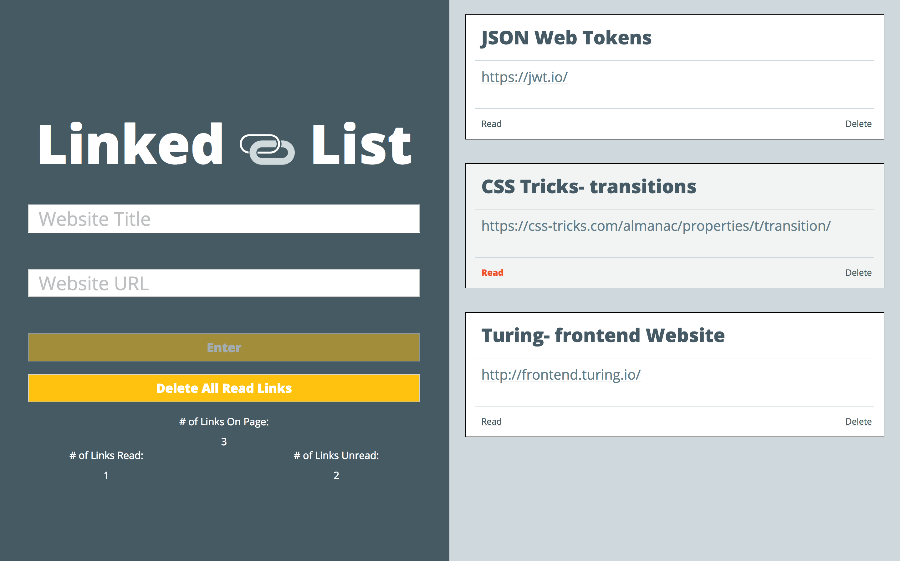

LinkedList is an application that allows for the user to save websites and their corressponding URL.  The user can view their saved websites in one place, mark them as read and remove them from the page.

This project was my second experience working with JavaScript and I gained experience capturing information from an input form and appending the user input to a page.

